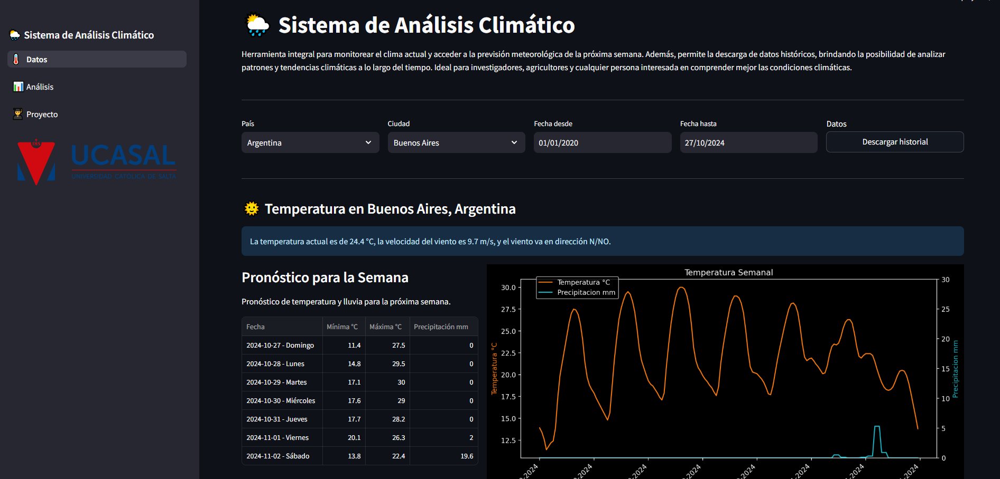

# 🌦 Sistema de Análisis Climático

Herramienta integral para monitorear el clima actual y acceder a la previsión meteorológica de la próxima semana. 
Además, permite la descarga de datos históricos, brindando la posibilidad de analizar patrones y tendencias climáticas 
a lo largo del tiempo. Ideal para investigadores, agricultores y cualquier persona interesada en comprender mejor las 
condiciones climáticas.

## 🔗 Fuentes de Datos
- Datos meteorológicos: [Open-Meteo](http://open-meteo.com)
- Base de datos de ciudades: [SimpleMaps](https://simplemaps.com/data/world-cities)

## 🚀 Demo en Vivo
Prueba la aplicación en: [Sistema de Análisis Climático](https://streamlit.app/)

## 🛠️ Instalación

### Prerequisitos
- Python 3.8 o superior
- Git

### Pasos de instalación

1. **Clonar el repositorio**
```bash
git clone https://github.com/ByBraiiaN/sistema-analisis-climatico.git
cd sistema-analisis-climatico
```

2. **Clonar el repositorio**
```bash
# Crear el entorno virtual
python -m venv env

# Activar el entorno virtual
# En Windows:
env\Scripts\activate

# En Linux/Mac:
source env/bin/activate
```

3. **Instalar dependencias**
```bash
pip install -r requirements.txt
```

4. **Ejecutar la aplicación**
```bash
streamlit run --client.showSidebarNavigation=False Examen_Final.py
```

5. **Acceder a la aplicación**
- Abre tu navegador y visita: http://localhost:8501

## 📷 Capturas de Pantalla

